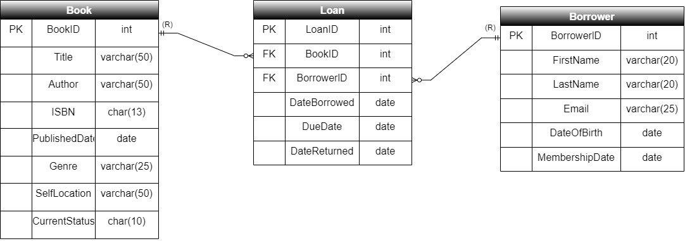

# Library Management System: Database Project

## Background

A local library wishes to transition from their traditional book-keeping to a more robust digital system. They want a platform to efficiently track books, borrowers, loans, returns, and offer insights into borrowing trends.

## Objective

Design and implement a relational database using MS SQL that supports the library's operations and offers extensive querying capabilities.

## Requirements

### 1. Design an Entity Relationship Model (ERM) Diagram

- **Entities**: Illustrate entities: **Books**, **Borrowers**, and **Loans**.
- **Attributes**: Detail attributes for each entity.
- **Relationships**: Exhibit connections between entities.
- **Connectivity and Cardinality**: Notate the relationship type between entities.
- **Keys**: Mark primary (PK) and foreign keys (FK).
- **Tools**: Opt for ERDPlus, Lucidchart, or similar tools. Include the diagram in the repository.

### 2. Design the Relational Schema using MS SQL

#### **Books**:
- **BookID** (PK)
- **Title**
- **Author**
- **ISBN**
- **Published Date**
- **Genre**
- **Shelf Location**
- **Current Status** ('Available' or 'Borrowed')

#### **Borrowers**:
- **BorrowerID** (PK)
- **First Name**
- **Last Name**
- **Email**
- **Date of Birth**
- **Membership Date**

#### **Loans**:
- **LoanID** (PK)
- **BookID** (FK)
- **BorrowerID** (FK)
- **Date Borrowed**
- **Due Date**
- **Date Returned** (NULL if not returned yet)

### 3. Build and Seed the Database

- Construct the database in MS SQL.
- Seed with fictional data: Populate 1000 books, 1000 borrowers, and 1000 loan records. Include DML scripts for seeding in the GitHub repository.

### 4. Complex Queries and Procedures

#### 1. List of Borrowed Books
- Retrieve all books borrowed by a specific borrower, including those currently unreturned.

#### 2. Active Borrowers with CTEs
- Identify borrowers who've borrowed 2 or more books but haven't returned any using CTEs.

#### 3. Borrowing Frequency using Window Functions
- Rank borrowers based on borrowing frequency.

#### 4. Popular Genre Analysis using Joins and Window Functions
- Identify the most popular genre for a given month.

#### 5. Stored Procedure - Add New Borrowers
- **Procedure Name**: **`sp_AddNewBorrower`**
- **Purpose**: Streamline the process of adding a new borrower.
- **Parameters**: **`FirstName`**, **`LastName`**, **`Email`**, **`DateOfBirth`**, **`MembershipDate`**.
- **Implementation**: Check if an email exists; if not, add to Borrowers. If existing, return an error message.
- **Return**: The new BorrowerID or an error message.

#### 6. Database Function - Calculate Overdue Fees
- **Function Name**: **`fn_CalculateOverdueFees`**
- **Purpose**: Compute overdue fees for a given loan.
- **Parameter**: **`LoanID`**
- **Implementation**: Charge fees based on overdue days: $1/day for up to 30 days, $2/day after.
- **Return**: Overdue fee for the LoanID.

#### 7. Database Function - Book Borrowing Frequency
- **Function Name**: **`fn_BookBorrowingFrequency`**
- **Purpose**: Gauge the borrowing frequency of a book.
- **Parameter**: **`BookID`**
- **Implementation**: Count the number of times the book has been issued.
- **Return**: Borrowing count of the book.

#### 8. Overdue Analysis
- List all books overdue by more than 30 days with their associated borrowers.

#### 9. Author Popularity using Aggregation
- Rank authors by the borrowing frequency of their books.

#### 10. Genre Preference by Age using Group By and Having
- Determine the preferred genre of different age groups of borrowers. (Groups are (0,10), (11,20), (21,30)…)

#### 11. Stored Procedure - Borrowed Books Report
- **Procedure Name**: **`sp_BorrowedBooksReport`**
- **Purpose**: Generate a report of books borrowed within a specified date range.
- **Parameters**: **`StartDate`**, **`EndDate`**
- **Implementation**: Retrieve all books borrowed within the given range, with details like borrower name and borrowing date.
- **Return**: Tabulated report of borrowed books.

### 12. Trigger Implementation
- Design a trigger to log an entry into a separate AuditLog table whenever a book's status changes from 'Available' to 'Borrowed' or vice versa. The AuditLog should capture BookID, StatusChange, and ChangeDate.

### 13. SQL Stored Procedure with Temp Table
- Design a stored procedure that retrieves all borrowers who have overdue books. Store these borrowers in a temporary table, then join this temp table with the Loans table to list out the specific overdue books for each borrower.

### 14. Weekly Peak Days
- The library is planning to employ a new part-time worker. This worker will work 3 days weekly in the library. From the data you have, determine the most 3 days in the week that have the most share of the loans and display the result of each day as a percentage of all loans. Sort the results from the highest percentage to the lowest percentage (e.g., 25.18% of the loans happen on Monday...).

## ERD:

